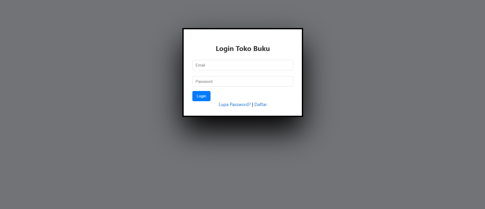
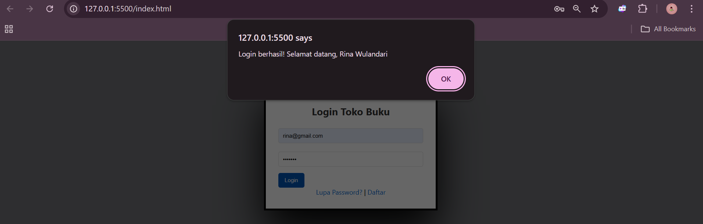
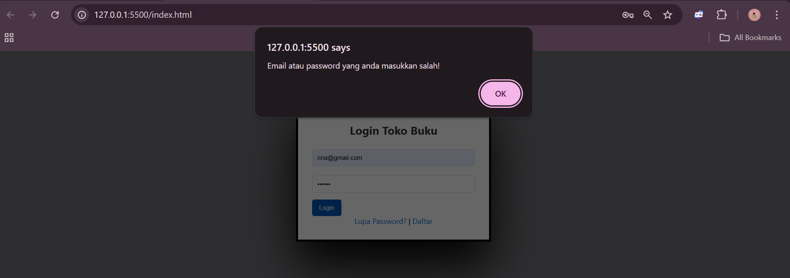
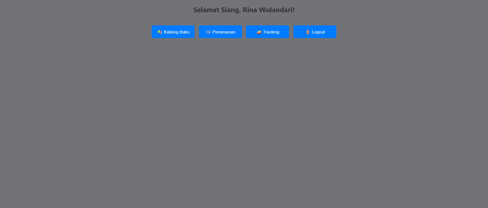
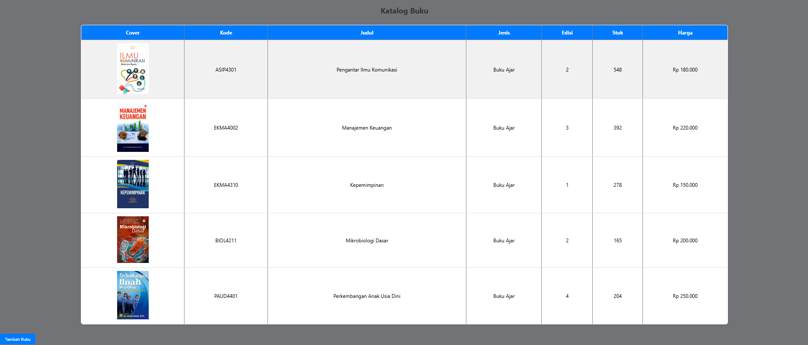
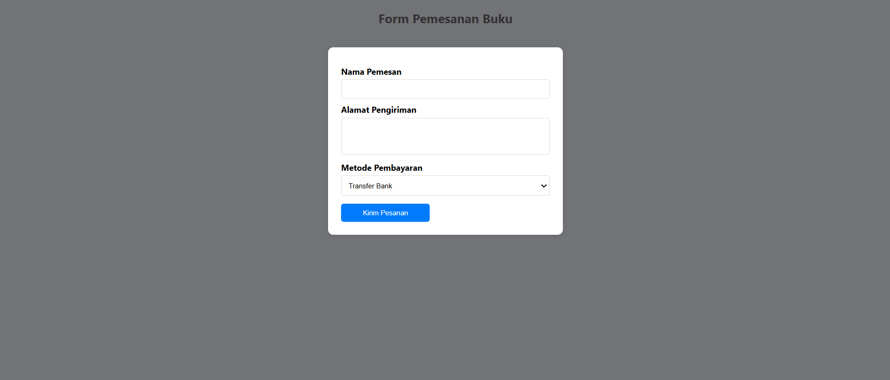
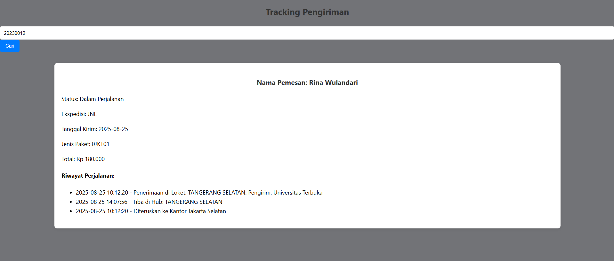

# Tokobukuonlineweb1

### Nama: M. Rizqy Al Rasyd
### Nim : 312410424
### Kelas : TI.24.A3

# MENU LOGIN
## CODE
``` <!DOCTYPE html>
<html lang="id">
<head>
  <meta charset="UTF-8">
  <title>Login - Toko Buku Online</title>
  <link rel="stylesheet" href="style.css">
</head>
<body>
  <div class="login-container">
    <h2>Login Toko Buku</h2>
    <input type="email" id="email" placeholder="Email" required>
    <input type="password" id="password" placeholder="Password" required>
    <button onclick="login()">Login</button>

    <div class="links">
      <a href="#" onclick="openModal('forgotModal')">Lupa Password?</a> |
      <a href="#" onclick="openModal('registerModal')">Daftar</a>
    </div>
  </div>

  <div id="forgotModal" class="modal">
    <div class="modal-content">
      <span class="close" onclick="closeModal('forgotModal')">&times;</span>
      <h3>Lupa Password</h3>
      <input type="email" placeholder="Masukkan email Anda">
      <button>Kirim</button>
    </div>
  </div>

  <div id="registerModal" class="modal">
    <div class="modal-content">
      <span class="close" onclick="closeModal('registerModal')">&times;</span>
      <h3>Daftar Akun</h3>
      <input type="text" placeholder="Nama Lengkap">
      <input type="email" placeholder="Email">
      <input type="password" placeholder="Password">
      <button>Daftar</button>
    </div>
  </div>

  <script src="data.js"></script>
  <script src="script.js"></script>
</body>
</html>
```

## HASIL


## JIKA BERHASIL LOGIN

## JIKA GAGAL LOGIN



# TAMPILAN MENU UTAMA
## CODE 
``` <!DOCTYPE html>
<html lang="id">
<head>
  <meta charset="UTF-8">
  <title>Dashboard - Toko Buku Online</title>
  <link rel="stylesheet" href="style.css">
</head>
<body onload="greeting()">
  <h2 id="greet"></h2>
  <nav>
    <button onclick="location.href='stok.html'">📚 Katalog Buku</button>
    <button onclick="location.href='checkout.html'">🛒 Pemesanan</button>
    <button onclick="location.href='tracking.html'">🚚 Tracking</button>
    <button onclick="logout()">🚪 Logout</button>
  </nav>

  <script>
    function greeting() {
      const user = JSON.parse(localStorage.getItem("userLogin"));
      const hour = new Date().getHours();
      let greet = "Selamat Malam";
      if (hour < 10) greet = "Selamat Pagi";
      else if (hour < 15) greet = "Selamat Siang";
      else if (hour < 18) greet = "Selamat Sore";

      document.getElementById("greet").innerText =
        `${greet}, ${user ? user.nama : "Pengunjung"}!`;
    }

    function logout() {
      localStorage.removeItem("userLogin");
      window.location.href = "index.html";
    }
  </script>
</body>
</html>
```

## HASIL


# TAMPILAN CATALOG/STOK
## CODE
``` <!DOCTYPE html>
<html lang="id">
<head>
  <meta charset="UTF-8">
  <title>Katalog Buku</title>
  <link rel="stylesheet" href="style.css">
  <script src="data.js"></script>
</head>
<body onload="loadKatalog()">
  <h2>Katalog Buku</h2>
  <table id="tabelBuku" border="1">
    <tr>
      <th>Cover</th><th>Kode</th><th>Judul</th><th>Jenis</th><th>Edisi</th><th>Stok</th><th>Harga</th>
    </tr>
  </table>
  <button onclick="tambahBaris()">Tambah Buku</button>

  <script>
    function loadKatalog() {
      const table = document.getElementById("tabelBuku");
      dataKatalogBuku.forEach(buku => {
        const row = table.insertRow();
        row.innerHTML = `
          <td></td>
          <td>${buku.kodeBarang}</td>
          <td>${buku.namaBarang}</td>
          <td>${buku.jenisBarang}</td>
          <td>${buku.edisi}</td>
          <td>${buku.stok}</td>
          <td>${buku.harga}</td>
        `;
      });
    }

    function tambahBaris() {
      const table = document.getElementById("tabelBuku");
      const row = table.insertRow();
      row.innerHTML = `
        <td><input placeholder="Kode"></td>
        <td><input placeholder="Judul"></td>
        <td><input placeholder="Jenis"></td>
        <td><input placeholder="Edisi"></td>
        <td><input placeholder="Stok"></td>
        <td><input placeholder="Harga"></td>
      `;
    }
  </script>
</body>
</html>
```
## HASIL


# TAMPILAN PEMESANAN
## CODE
``` <!DOCTYPE html>
<html lang="id">
<head>
  <meta charset="UTF-8">
  <title>Pemesanan Buku</title>
  <link rel="stylesheet" href="style.css">
</head>
<body>
  <h2>Form Pemesanan Buku</h2>
  <form onsubmit="return konfirmasiPesan()">
    <label>Nama Pemesan</label>
    <input type="text" id="nama" required>

    <label>Alamat Pengiriman</label>
    <textarea id="alamat" required></textarea>

    <label>Metode Pembayaran</label>
    <select id="bayar">
      <option>Transfer Bank</option>
      <option>QRIS</option>
      <option>COD</option>
    </select>

    <button type="submit">Kirim Pesanan</button>
  </form>

  <script>
    function konfirmasiPesan() {
      const nama = document.getElementById("nama").value;
      const alamat = document.getElementById("alamat").value;
      const bayar = document.getElementById("bayar").value;

      if (nama && alamat) {
        alert(`Pesanan atas nama ${nama} berhasil!\nPembayaran: ${bayar}`);
        return true;
      } else {
        alert("Harap isi semua data!");
        return false;
      }
    }
  </script>
</body>
</html>
```

## HASIL


# TAMPILAN MENU TRACKING
## CODE
``` <!DOCTYPE html>
<html lang="id">
<head>
  <meta charset="UTF-8">
  <title>Tracking Pengiriman</title>
  <link rel="stylesheet" href="style.css">
  <script src="data.js"></script>
</head>
<body>
  <h2>Tracking Pengiriman</h2>
  <input id="noDO" placeholder="Masukkan Nomor Delivery Order">
  <button onclick="cari()">Cari</button>
  <div id="hasil"></div>

  <script>
    function cari() {
      const no = document.getElementById("noDO").value.trim();
      const hasil = document.getElementById("hasil");

      if (dataTracking[no]) {
        const data = dataTracking[no];
        hasil.innerHTML = `
          <h3>Nama Pemesan: ${data.nama}</h3>
          <p>Status: ${data.status}</p>
          <p>Ekspedisi: ${data.ekspedisi}</p>
          <p>Tanggal Kirim: ${data.tanggalKirim}</p>
          <p>Jenis Paket: ${data.paket}</p>
          <p>Total: ${data.total}</p>
          <h4>Riwayat Perjalanan:</h4>
          <ul>${data.perjalanan.map(p => `<li>${p.waktu} - ${p.keterangan}</li>`).join('')}</ul>
        `;
      } else {
        hasil.innerHTML = `<p>Nomor DO tidak ditemukan.</p>`;
      }
    }
  </script>
</body>
</html>
```

## HASIL


## TAMPILAN JIKA MEMASUKKAN DELIVERY ORDER

